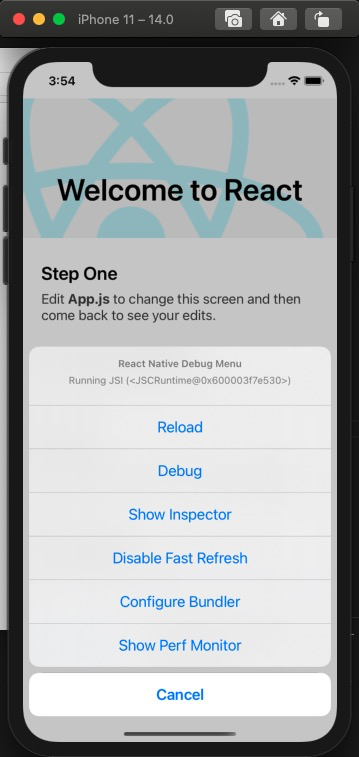
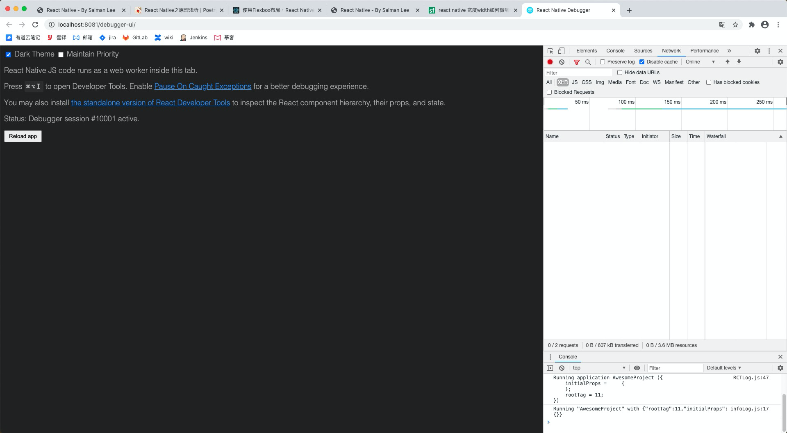
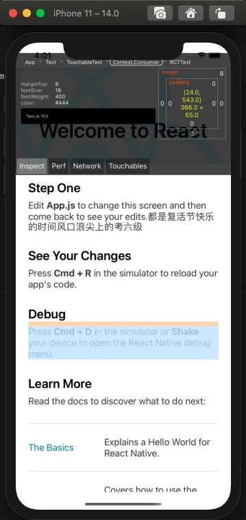

title: React Native
speaker: Salman Lee
plugins:
    - echarts
prismTheme: tomorrow

<slide class="bg-black-blue aligncenter" image="https://source.unsplash.com/C1HhAQrbykQ/ .dark">

# React Native {.text-landing.text-shadow}

By Salman Lee {.text-intro}

- [RN 官方网站](https://reactnative.dev/)

- [RN 中文网](https://www.reactnative.cn/)

<slide class="bg-black-blue aligncenter" image="https://source.unsplash.com/C1HhAQrbykQ/ .dark">

# 概览 {.text-landing.text-shadow}

- **简介**
- **安装**
- **运行**
- **常用组件**
- **样式**
- **调试**
- **路由**
- **实现原理**

<slide class="bg-black-blue aligncenter" image="https://source.unsplash.com/C1HhAQrbykQ/ .dark">

# 简介 {.text-landing.text-shadow}

 用React一套代码开发Android/IOS App

```
//代码长这样

import React, { Component } from 'react';
import { Text, View , Image } from 'react-native';

class WhyReactNativeIsSoGreat extends Component {
  render() {
    return (
      <View>
       <Image
          source={{uri: 'https://i.chzbgr.com/full/7345954048/h7E2C65F9/'}}
          style={{width: 320, height:180}}
        />
        <Text>
          基本上就是用原生组件比如'View'和'Text'
          来代替web组件'div'和'span'。
        </Text>
      </View>
    );
  }
}
```

<slide class="bg-black-blue aligncenter" image="https://source.unsplash.com/C1HhAQrbykQ/ .dark">

# 安装 {.text-landing.text-shadow}

## 简易沙盒环境

中文网译注：沙盒环境大量依赖于国外网络环境，也不能直接安装第三方原生组件。不建议国内用户使用。
自己注：所谓沙盒环境是指使用 [expo](https://expo.io/learn) 脚手架搭建项目，expo搭建项目时候可分两种workflow(Managed workflow / Bare workflow),
前者完全沙盒，不能安装三方原生组件只能用expo提供的，但是可以托管给expo服务器打包应用，热更新等；后者可以使用三方原生组件，但是不能托管打包，热更新等。
所以Managed workflow 才是那种不支持安装第三方原生组件的情况。

`npm install -g expo-cli`

`expo init AwesomeProject`


简要介绍下 [expo](https://expo.io/learn) ：（仅仅基于Managed workflow，因为Bare workflow没有做过不敢瞎说）

- 优点：让前端人员完全不接触原生代码甚至是xcode对项目的配置，提供了一些基本的原生组件可以直接使用，如：相机，app根目录访问等；还能托管打包应用，热更新等。
- 缺点：社区上的三方原生组件不能用，自己写的更别提了，能用expo提供的，也还够用，但是经常有各种bug，你只能放置它等待官方大神解决；不能触碰原生代码或配置文件这点其实很难受，有很多东西做不到，比如：应用名的国际化。

<slide class="bg-black-blue aligncenter" image="https://source.unsplash.com/C1HhAQrbykQ/ .dark">

# 安装 {.text-landing.text-shadow}

## 完整原生环境

### Mac 环境下 Android 与 IOS 共同需要

Node、Watchman

推荐使用 [homebrew](https://brew.sh/) 安装

```
brew install node
brew install watchman
```

Node版本要>=12

[Watchman](https://facebook.github.io/watchman/):则是由 Facebook 提供的监视文件系统变更的工具

<slide class="bg-black-blue aligncenter" image="https://source.unsplash.com/C1HhAQrbykQ/ .dark">

# 安装 {.text-landing.text-shadow}

## 完整原生环境

### Mac + IOS

Xcode 和 CocoaPods

Xcode:mac app store 下载

[CocoaPods](https://cocoapods.org/):是用 Ruby 编写的包管理器。从 0.60 版本开始 react native 的 iOS 版本需要使用 CocoaPods 来管理依赖。

`sudo gem install cocoapods`
or
`brew install cocoapods`

<slide class="bg-black-blue aligncenter" image="https://source.unsplash.com/C1HhAQrbykQ/ .dark">

# 安装 {.text-landing.text-shadow}

## 完整原生环境

### Mac + Android

JDK 和 Android Studio

[JDK](https://www.oracle.com/java/technologies/javase/javase-jdk8-downloads.html):官网下载或者homebrew搜索，要求jdk8也就是jdk1.8

[Android Studio](https://developer.android.com/studio/index.html):官网下载或者homebrew搜索,安装有些繁琐直接上链接 [安装](https://reactnative.cn/docs/getting-started#1-%E5%AE%89%E8%A3%85-android-studio)

<slide class="bg-black-blue aligncenter" image="https://source.unsplash.com/C1HhAQrbykQ/ .dark">

# 安装 {.text-landing.text-shadow}

## 完整原生环境

### 生成app脚手架

`npx react-native init AwesomeProject`

<slide class="bg-black-blue aligncenter" image="https://source.unsplash.com/C1HhAQrbykQ/ .dark">

# 运行

## IOS

```
cd AwesomeProject
yarn ios
# 或者
yarn react-native run-ios
# 也可以启用xCode打开主项目文件.xcworkspace，使用xCode如原生IOS应用一样运行
```

## Android

```
cd AwesomeProject
yarn android
# 或者
yarn react-native run-android
# 也可以使用Android Studio原生项目般的运行
```

<slide class="bg-black-blue aligncenter" image="https://source.unsplash.com/C1HhAQrbykQ/ .dark">

# 常用组件

- [View](https://reactnative.cn/docs/view):视图组件

- [Text](https://www.reactnative.cn/docs/text):文本组件

- [Image](https://www.reactnative.cn/docs/image):图片组件

- [TextInput](https://www.reactnative.cn/docs/textinput):文本输入组件

- [ScrollView](https://www.reactnative.cn/docs/scrollview):滚动视图组件

- [Button](https://www.reactnative.cn/docs/button):按钮组件

- [FlatList](https://www.reactnative.cn/docs/flatlist):列表组件

```
import React, { Component } from "react";
import { View, Text } from "react-native";

class App extends Component {
  render() {
    return (
      <View
        style={{
          flexDirection: "row",
          height: 100,
          padding: 20
        }}
      >
        <View style={{ backgroundColor: "blue", flex: 0.3 }} />
        <View style={{ backgroundColor: "red", flex: 0.5 }} />
        <Text>Hello World!</Text>
      </View>
    );
  }
}

export default App;
```

<slide class="bg-black-blue aligncenter" image="https://source.unsplash.com/C1HhAQrbykQ/ .dark">

# 样式

```
import {StyleSheet} from 'react-native';
import { StyleSheet, Text, View , Dimensions } from 'react-native';

const {width, height, scale} = Dimensions.get('window');

const test = () => {
    return (
      <View style={styles.container}>
        <View style={styles.demo1}>
          <text style={styles.demo1Text}></text>
        </View>
        <View style={styles.demo2} />
      </View>
    );
};

const styles = StyleSheet.create({
  container: {  
    width: width
  },
  demo1:{
    width:'100%',
    height: 50
  },
  demo1Text:{
    color: 'blue',
    fontWeight: 'bold',
    fontSize: 30,
  }
  demo2:{
   flex:1,
  },
});

export default test;
```

<slide class="bg-black-blue " image="https://source.unsplash.com/C1HhAQrbykQ/ .dark">

# 样式

## 与react区别大致于 

1. 没有class，style用 StyleSheet.create({})创建;
2. React Native 中的尺寸都是无单位的，表示的是与设备像素密度无关的逻辑像素点;
3. 使用flex布局，默认方向为纵向排列{flexDirection: 'column'}，设置{flexDirection: 'row'}可以改横向,{justifyContent:'center',align-items:'center'}

## [flex布局](https://www.reactnative.cn/docs/flexbox)


<slide class="bg-black-blue aligncenter" image="https://source.unsplash.com/C1HhAQrbykQ/ .dark">

# 调试

- 真机摇一摇
- Ios Simulator : cmd + D 
- Android Emulator : cmd + M 

 

## 特色

- 实时相应 
- 调试网络  
- 调试样式   

 




<slide class="bg-black-blue aligncenter" image="https://source.unsplash.com/C1HhAQrbykQ/ .dark">

# 路由

- [react-navigation](https://reactnavigation.org/)
- [react-navigation中文网](https://www.reactnavigation.org.cn/)

[快速开始](https://www.reactnavigation.org.cn/docs/guide-quick-start)

<slide class="bg-black-blue aligncenter" image="https://source.unsplash.com/C1HhAQrbykQ/ .dark">

# 实现原理

## 工作原理

React Native 渲染 在 React 框架中，JSX 源码通过 React 框架最终渲染到了浏览器的真实 DOM 中，而在 React Native 框架中，JSX 源码通过 React Native 框架编译后，通过对应平台的 Bridge 实现了与原生框架的通信。如果我们在程序中调用了 React Native 提供的 API，那么 React Native 框架就通过 Bridge 调用原生框架中的方法。 因为 React Native 的底层为 React 框架，所以如果是 UI 层的变更，那么就映射为虚拟 DOM 后进行 diff 算法，diff 算法计算出变动后的 JSON 映射文件，最终由 Native 层将此 JSON 文件映射渲染到原生 App 的页面元素上，最终实现了在项目中只需要控制 state 以及 props 的变更来引起 iOS 与 Android 平台的 UI 变更。 编写的 React Native代码最终会打包生成一个 main.bundle.js 文件供 App 加载，此文件可以在 App 设备本地，也可以存放于服务器上供 App 下载更新，当将其放到服务器端也就为热更新提供了铺垫。


<slide class="bg-black-blue aligncenter" image="https://source.unsplash.com/C1HhAQrbykQ/ .dark">


# 实现原理

## 与端上通信

在与原生框架通信中，React Native 采用了 JavaScriptCore 作为 JS VM，中间通过 JSON 文件与 Bridge 进行通信。而如果在使用 Chrome 浏览器进行调试时，那么所有的 JavaScript 代码都将运行在 Chrome 的 V8 引擎中，与原生代码通过 WebSocket 进行通信。
 


<slide class="bg-black-blue " image="https://source.unsplash.com/C1HhAQrbykQ/ .dark">


# 实现原理

## JavaScriptCore

WebKit 的 JavaScript 引擎的一个封装。包括几个类：

1. JSContext 类似用来创建一个全局对象，如浏览器中的window对象。
2. JSValue 一个JSValue实例就是一个JavaScript值的引用。
3. JSManagedValue  JSValue的封装，用以解决JS和OC代码之间循环引用的问题。
4. JSVirtualMachine 一个实例就是一个完整独立的JavaScript的执行环境，执行提供底层资源。
5. JSExport JSExport是一个协议,通过实现它可以完成把一个native对象暴漏给JS。


<slide class="bg-black-blue " image="https://source.unsplash.com/C1HhAQrbykQ/ .dark">

# 实现原理

## Bridge 工作流程

1. UIManager：在Native侧，是在iOS/Android里主要运行的线程。只有它有权限可以修改客户端UI。
2. JS Thread：运行打包好的main.bundle.js文件，这个文件包含了RN的所有业务逻辑、行为和组件。
3. Shadow Node/Tree：在Native层的一个组件树，可以帮助监听App内的UI变化，有点像ReactJS里的虚拟Dom和Dom之间的关系。
4. Yoga：用来计算layout。是Facebook写的一个C引擎，用来把基于Flexbox的布局转换到Native的布局系统。

理解了上面的一些基础概念，让我们来看下打开App时，每一步发生了什么：

1. 用户点击App的图标
2. UIManager线程：加载所有的Native库和Native组件比如 Text、Button、Image等
告诉Js线程，Native部分准备好了，Js侧开始加载main.bundle.js，这里面包含了所有的js和react逻辑以及组件。
3. Js侧通过Bridge发送一条JSON消息到Native侧，告诉Native怎么创建UI。值得一提的是：所有经过Bridge的通信都是异步的，并且是打包发送的。
4. Shadow线程最先拿到消息，然后创建UI树
5. 然后，它使用Yoga布局引擎去获取所有基于flex样式的布局，并且转化成Native的布局，宽、高、间距等。

<slide class="bg-black-blue aligncenter" image="https://source.unsplash.com/C1HhAQrbykQ/ .dark">

# 实现原理

## 怎么创建 Bridge（自定义原生组件）

[Android举例子](https://www.reactnative.cn/docs/native-modules-android)

<slide class="bg-black-blue aligncenter" image="https://source.unsplash.com/C1HhAQrbykQ/ .dark">

# END

